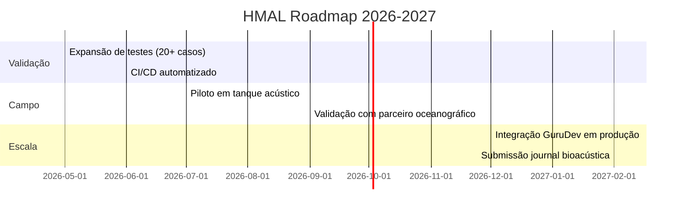

# Especificação Técnica: HMAL v0.1.0

> Hubstry Marine Acoustic Layer — Protocolo de comunicação acústica subaquática baseado em séries harmônicas racionais

**Versão**: 0.1.0-alpha | **Status**: TRL 4.5 (desk-study + simulação) | **Licença**: BSL-1.1 + CC-BY-4.0

---

## 1. Visão Geral

O HMAL adapta o protocolo HPG 1.0 (Harmonic Protocol Grid) para o meio aquático, utilizando séries harmônicas racionais como espaço de canais nativo. A propagação acústica subaquática segue física ondulatória harmônica — e a comunicação cetácea opera naturalmente neste formalismo.

### Casos de Uso
| Caso | Descrição | Prioridade |
|------|-----------|------------|
| Bioacústica científica | Mapeamento de vocalizações cetáceas para análise comportamental | Alta |
| Monitoramento ambiental | Sensores subaquáticos para conservação e detecção de impacto antrópico | Alta |
| Comunicação segura offshore | Autenticação leve para ROVs, dutos e UUVs | Média |
| Interface homem-cetáceo | Protótipo de decodificação semântica de vocalizações | Baixa (futuro) |

---

## 2. Arquitetura

### 2.1 Pilha de Protocolo (Adaptação OSI)
```
┌─────────────────────────┐
│ Aplicação               │ ← GuruDev bridge (opcional)
├─────────────────────────┤
│ Segurança (HSL)         │ ← H-Challenge/Response (~200 B)
├─────────────────────────┤
│ Rede (NET)              │ ← Roteamento por grade de profundidade
├─────────────────────────┤
│ Controle de Acesso (MAC)│ ← Channel hopping harmônico determinístico
├─────────────────────────┤
│ Física (PHY-M)          │ ← Geração de waveform s(t) = Σ A·sin(2π·a/b·f₀·t+φ)
└─────────────────────────┘
```

### 2.2 Parâmetros Principais
| Parâmetro | Valor Padrão | Descrição |
|-----------|-------------|-----------|
| `f0_base` | 25.0 Hz | Frequência fundamental de referência |
| `harmonic_order` | 16 | Ordem N do conjunto H_N (4, 8, 16, 32) |
| `mode` | "hybrid" | whale/dolphin/hybrid (ajusta f₀ adaptativo) |
| `tolerance` | 1e-4 | Tolerância para matching racional (100 ppm) |
| `phase_polarity` | true | Codifica direção via φ ∈ {0, π} |

---

## 3. API Reference

### 3.1 Core: `HarmonicProtocol`
```python
class HarmonicProtocol:
    def __init__(self, f0_base: float, harmonic_order: int = 16, mode: str = "hybrid")
    @property
    def f0_adaptive(self) -> float  # Retorna f₀ ajustado por modo
    def generate_waveform(self, channels: list, duration: float, sample_rate: int = 48000) -> tuple
    def sync_window(self, channel_ratios: list) -> float  # Calcula T_sync
```

### 3.2 Core: `RationalChannel`
```python
@dataclass(frozen=True)
class RationalChannel:
    a: int  # Numerador
    b: int  # Denominador
    @property
    def priority(self) -> float  # P(a/b) = 1/(a+b)
    def frequency(self, f0: float) -> float  # f = (a/b) · f₀
```

### 3.3 Bioacoustics: `map_cetacean_vocalization`
```python
def map_cetacean_vocalization(
    frequencies: list[float],
    f0_base: float = 25.0,
    harmonic_order: int = 16,
    tolerance: float = 1e-4,
    species: str = None
) -> list[dict]:
    """
    Mapeia frequências observadas para canais harmônicos a/b ∈ H_N.
    
    Retorna lista de dicts com:
    - frequency_hz: frequência original
    - channel_ratio: string "a/b"
    - priority: métrica P(a/b)
    - biological_interpretation: classificação heurística
    - error_ppm: erro de aproximação em partes por milhão
    """
```

### 3.4 Security: `HChallengeResponse`
```python
class HChallengeResponse:
    def __init__(self, secret_seed: bytes)
    def generate_challenge(self, n_channels: int = 3) -> dict
    def compute_response(self, challenge: dict) -> bytes  # ~16 B HMAC
    def verify_response(self, challenge: dict, response: bytes) -> bool
```

---

## 4. Integração com Padrões Existentes

### 4.1 Overlay sobre NATO C2/JANUS
- Faixa JANUS: 7–12 kHz
- HMAL mapeia canais a/b dentro desta faixa quando `mode="janus_overlay"`
- Autenticação HSL ocorre antes do payload JANUS padrão
- Compatibilidade: `JanusCompatibilityMode.OVERLAY` (padrão) ou `STANDALONE`

### 4.2 Ponte com GuruDev Core (Opcional)
```python
from hmal.gurudev import ontology_bridge
semantic_vector = ontology_bridge.map_vocalization_to_ontology(mapped_channel)
# Retorna vetor R⁶ hexarrelacional + casos gramaticais
```

---

## 5. Limitações Conhecidas

| Limitação | Impacto | Mitigação |
|-----------|---------|-----------|
| Desk-study (sem validação em campo) | Resultados preliminares | Parceria com laboratórios oceanográficos para TRL 5-6 |
| Classificação biológica heurística | Precisão limitada | Treinar ML com dados rotulados por especialistas |
| H_N limitado a N=32 | Trade-off resolução vs. computação | Otimizar para ARM Cortex-M4 em dispositivos embarcados |
| Propagação em águas rasas não modelada | Perda de precisão em estuários | Implementar modelo Bellhop-lite em fase futura |

---

## 6. Roadmap Técnico



---

*Documento gerado em Maio 2026. Para contribuições, consulte CONTRIBUTING.md.*
